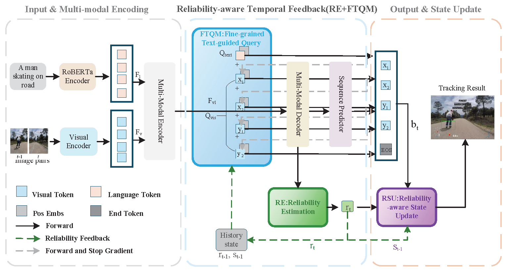
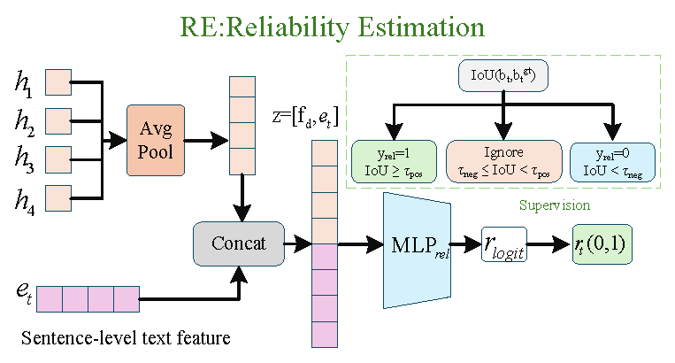
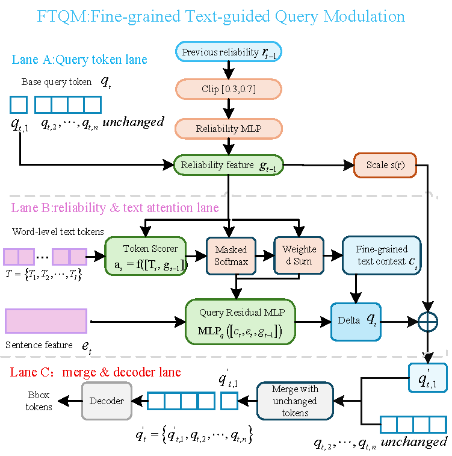
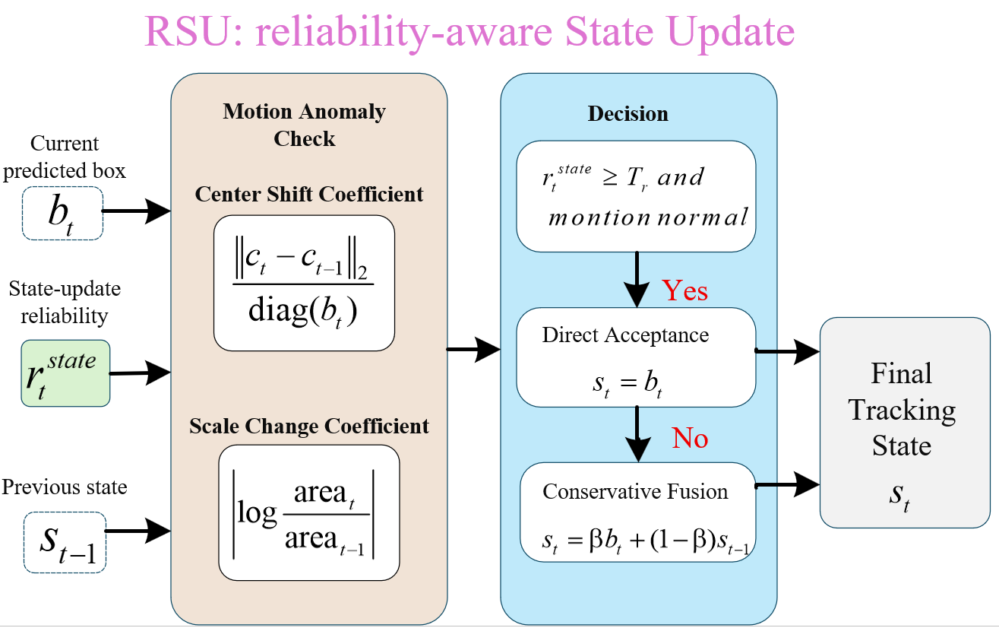

# FRTFTrack: Reliability-Aware Temporal Feedback for Data-Efficient Vision-Language Tracking

This repository provides the project page for **FRTFTrack**, a reliability-aware temporal feedback framework for data-efficient vision-language tracking.

## Overview

FRTFTrack is built upon the generative vision-language tracking baseline **MMTrack**. It keeps the original vision-language backbone unchanged and introduces three lightweight components:

- **RE**: Reliability Estimation
- **FTQM**: Fine-grained Text-guided Query Modulation
- **RSU**: Reliability-aware State Update

The goal of FRTFTrack is to improve tracking stability and data efficiency under low-shot training settings.

## Framework

## Main Components

### Reliability Estimation

### Fine-grained Text-guided Query Modulation

### Reliability-aware State Update

## Method

FRTFTrack forms a closed temporal feedback loop consisting of prediction, reliability estimation, query modulation, and state update.

The reliability estimation module estimates the reliability of the current prediction. The reliability signal is then fed back into subsequent query construction and state update, enabling the tracker to adjust the tracking process according to historical prediction quality.

## Results

FRTFTrack is evaluated on TNL2K, LaSOT, and OTB99-Lang under full-data and low-shot training settings. Compared with MMTrack, FRTFTrack maintains comparable performance under full-data training and achieves more pronounced improvements under low-shot training.

| Setting | Dataset | MMTrack AUC | FRTFTrack AUC | Gain |
|---|---:|---:|---:|---:|
| 1/6 samples | TNL2K | 49.6 | 51.7 | +2.1 |
| 1/6 samples | LaSOT | 62.8 | 64.9 | +2.1 |
| 1/6 samples | OTB99-Lang | 65.2 | 68.7 | +3.5 |
| 1/3 samples | TNL2K | 51.0 | 53.9 | +2.9 |
| 1/3 samples | LaSOT | 65.0 | 67.6 | +2.6 |
| 1/3 samples | OTB99-Lang | 67.0 | 69.0 | +2.0 |

## Citation

The citation will be updated after publication.

## Contact

For questions about this project, please contact the authors.

## Code

The code will be released upon acceptance.

