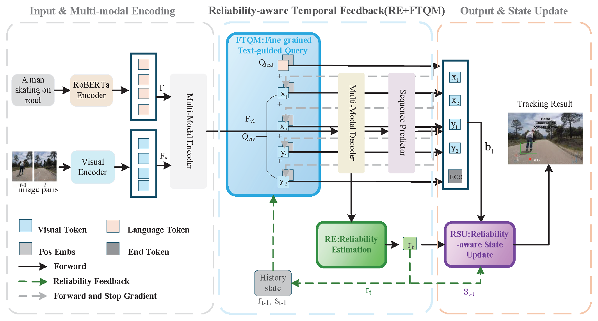
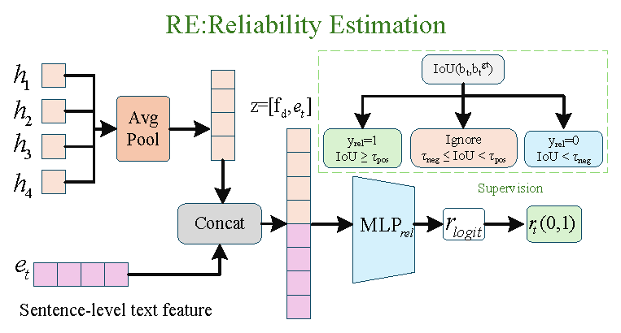
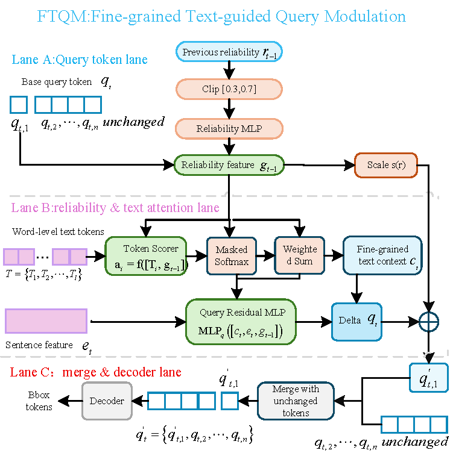
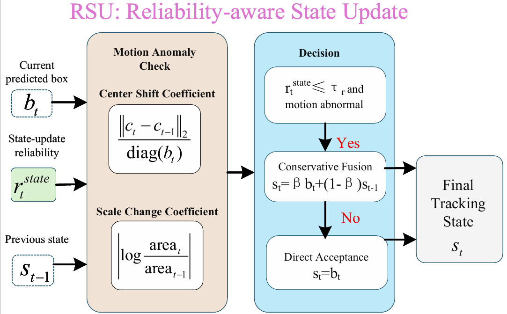

# FRTFTrack: Reliability-Aware Temporal Feedback for Data-Efficient Vision-Language Tracking

Official PyTorch implementation of **FRTFTrack**, a reliability-aware temporal feedback framework for data-efficient vision-language tracking.

[[Pretrained model](https://github.com/Hdf2985880455/FRTFTrack/releases/latest)]
[[MMTrack baseline](https://github.com/Azong-HQU/MMTrack)]

## Overview

FRTFTrack is built upon the generative vision-language tracker **MMTrack**. It keeps the original vision-language backbone unchanged and introduces three lightweight components:

- **RE**: Reliability Estimation;
- **FTQM**: Fine-grained Text-guided Query Modulation;
- **RSU**: Reliability-aware State Update.

These components form a temporal feedback loop that uses prediction reliability to guide subsequent query construction and state updating. FRTFTrack is designed to improve tracking stability and sample efficiency when the per-epoch training budget is limited.

## Framework



**Figure 1. Overall framework of FRTFTrack.** The estimated reliability is fed back to guide subsequent query modulation and state updating.

### Reliability Estimation



**Figure 2. Reliability Estimation (RE).** RE estimates the reliability of the current prediction using aggregated decoder-state features and sentence-level text semantics.

### Fine-grained Text-guided Query Modulation



**Figure 3. Fine-grained Text-guided Query Modulation (FTQM).** FTQM uses historical reliability to guide word-level token selection and generate a dynamic query residual.

### Reliability-aware State Update



**Figure 4. Reliability-aware State Update (RSU).** RSU controls temporal state fusion according to prediction reliability and motion variation, reducing error propagation from unreliable states.

## Repository Structure

```text
FRTFTrack/
├── experiments/mmtrack/    # MMTrack and FRTFTrack configuration files
├── figures/                # Framework and module illustrations
├── lib/                    # Models, training, datasets, and evaluation code
├── scripts/                # Auxiliary experiment scripts
├── tools/                  # Utility scripts
├── tracking/               # Training, testing, and result-analysis entry points
├── install.sh
├── ostrack_cuda113_env.yaml
├── train.sh
└── test.sh
```

## Installation

The code was developed with Python 3.8 and PyTorch. We recommend using a Conda environment.

```bash
git clone https://github.com/Hdf2985880455/FRTFTrack.git
cd FRTFTrack

conda create -n mmtrack python=3.8 -y
conda activate mmtrack
bash install.sh
```

Alternatively, the provided environment file can be used:

```bash
conda env create -f ostrack_cuda113_env.yaml
conda activate mmtrack
bash install.sh
```

## Set Project Paths

Create the default local path files:

```bash
python tracking/create_default_local_file.py \
  --workspace_dir . \
  --data_dir ./data \
  --save_dir ./output
```

If necessary, edit the generated path settings:

```text
lib/train/admin/local.py
lib/test/evaluation/local.py
```

Do not commit machine-specific absolute paths to the repository.

## Data Preparation

Download TNL2K, LaSOT, RefCOCO/RefCOCO+/RefCOCOg, and OTB99-Lang following the preparation instructions of [MMTrack](https://github.com/Azong-HQU/MMTrack). Place them under `data/`:

```text
FRTFTrack/
└── data/
    ├── lasot/
    ├── tnl2k/
    │   ├── train/
    │   └── test/
    ├── refcoco/
    │   ├── images/
    │   ├── refcoco/
    │   ├── refcoco+/
    │   └── refcocog/
    └── otb_lang/
        ├── OTB_query_test/
        ├── OTB_query_train/
        └── OTB_videos/
```

The datasets are not redistributed in this repository. Please follow their original licenses and terms of use.

## Pretrained Dependencies

Before training, download:

1. the pretrained [OSTrack](https://github.com/botaoye/OSTrack) initialization checkpoint;
2. [RoBERTa-base](https://huggingface.co/roberta-base).

Place them under `pretrained_networks/`:

```text
FRTFTrack/
└── pretrained_networks/
    ├── OSTrack_ep0300.pth.tar
    └── roberta-base/
        ├── config.json
        ├── merges.txt
        ├── pytorch_model.bin
        ├── tokenizer.json
        └── vocab.json
```

## Released FRTFTrack Checkpoint

The released epoch-147 checkpoint is available from [GitHub Releases](https://github.com/Hdf2985880455/FRTFTrack/releases/latest).

| Model | Configuration | Epoch | Download |
|---|---|---:|---|
| FRTFTrack | `reliability_query_stageC_baseline_scale008_scalemod_temporal.yaml` | 147 | [checkpoint](https://github.com/Hdf2985880455/FRTFTrack/releases/latest/download/FRTFTrack_ep0147.pth.tar) |

Download and place it in the path expected by the evaluation code:

```bash
mkdir -p output/checkpoints/train/mmtrack/reliability_query_stageC_baseline_scale008_scalemod_temporal

wget -O \
  output/checkpoints/train/mmtrack/reliability_query_stageC_baseline_scale008_scalemod_temporal/MMTrack_ep0147.pth.tar \
  https://github.com/Hdf2985880455/FRTFTrack/releases/latest/download/FRTFTrack_ep0147.pth.tar
```

For integrity verification:

```text
SHA256: REPLACE_WITH_THE_ACTUAL_SHA256_VALUE
```

The `TEST.EPOCH` field in the released configuration must match the checkpoint epoch (`147`).

## Training

The main released configuration is:

```text
experiments/mmtrack/reliability_query_stageC_baseline_scale008_scalemod_temporal.yaml
```

### Single-GPU training

```bash
python tracking/train.py \
  --script mmtrack \
  --config reliability_query_stageC_baseline_scale008_scalemod_temporal \
  --save_dir ./output \
  --mode single \
  --nproc_per_node 1 \
  --use_lmdb 0 \
  --use_wandb 0
```

### Two-GPU training

```bash
python tracking/train.py \
  --script mmtrack \
  --config reliability_query_stageC_baseline_scale008_scalemod_temporal \
  --save_dir ./output \
  --mode multiple \
  --nproc_per_node 2 \
  --use_lmdb 0 \
  --use_wandb 0
```

The effective optimization settings are defined in the YAML configuration. When changing the number of GPUs, keep the global batch size and other optimization settings consistent if exact numerical reproduction is required.

## Evaluation

The following commands use one GPU and six CPU testing workers.

### TNL2K

```bash
python tracking/test.py \
  --tracker_name mmtrack \
  --tracker_param reliability_query_stageC_baseline_scale008_scalemod_temporal \
  --dataset_name tnl2k_lang \
  --threads 6 \
  --num_gpus 1
```

### LaSOT

```bash
python tracking/test.py \
  --tracker_name mmtrack \
  --tracker_param reliability_query_stageC_baseline_scale008_scalemod_temporal \
  --dataset_name lasot_lang \
  --threads 6 \
  --num_gpus 1
```

### OTB99-Lang

```bash
python tracking/test.py \
  --tracker_name mmtrack \
  --tracker_param reliability_query_stageC_baseline_scale008_scalemod_temporal \
  --dataset_name otb_lang \
  --threads 6 \
  --num_gpus 1
```

Tracking results are written under:

```text
output/test/tracking_results/mmtrack/
```

Run the evaluation script after setting the desired tracker configuration and datasets in `tracking/analysis_results.py`:

```bash
python tracking/analysis_results.py
```

## Low-budget Training Protocol

The terms `1/6 samples` and `1/3 samples` refer to reduced **per-epoch sampling budgets** from the full training pool, rather than fixed annotated subsets:

| Setting | `DATA.TRAIN.SAMPLE_PER_EPOCH` |
|---|---:|
| 1/6 sampling budget | 10,000 |
| 1/3 sampling budget | 20,000 |
| Full per-epoch budget | 60,000 |

For an exact comparison, use the same data pool, data ratios, augmentation policy, optimizer, random seed, and evaluation protocol, and modify only the fields explicitly specified by the corresponding experiment configuration.

## Results

FRTFTrack is evaluated on TNL2K, LaSOT, and OTB99-Lang under reduced per-epoch sampling budgets.

### Low-budget AUC comparison

| Setting | Dataset | MMTrack AUC | FRTFTrack AUC | Gain |
|---|---:|---:|---:|---:|
| 1/6 samples | TNL2K | 49.6 | 51.7 | +2.1 |
| 1/6 samples | LaSOT | 62.8 | 64.9 | +2.1 |
| 1/6 samples | OTB99-Lang | 65.2 | 68.7 | +3.5 |
| 1/3 samples | TNL2K | 51.0 | 53.9 | +2.9 |
| 1/3 samples | LaSOT | 65.0 | 67.6 | +2.6 |
| 1/3 samples | OTB99-Lang | 67.0 | 69.0 | +2.0 |

### Low-budget ablation on AUC

| Method | TNL2K | LaSOT | OTB99-Lang |
|---|---:|---:|---:|
| Baseline | 49.6 | 62.8 | 65.2 |
| +RE | 49.2 | 61.7 | 65.4 |
| +RE+FTQM | 51.5 | 64.7 | 68.7 |
| +RE+FTQM+RSU | 51.7 | 64.9 | 68.7 |

RE provides the reliability signal used by the later feedback modules. The complete feedback loop formed by RE, FTQM, and RSU produces the most consistent improvement under the reduced sampling budget.

## Reproducibility Notes

- The repository contains the training and evaluation implementation used by FRTFTrack.
- The released YAML configuration records the model and optimization hyperparameters.
- The epoch-147 checkpoint is provided through GitHub Releases.
- Dataset files, OSTrack initialization weights, and RoBERTa-base weights must be downloaded separately because their redistribution is governed by their original licenses.
- Small numerical differences can arise from CUDA, PyTorch, hardware, and nondeterministic GPU operations.

## Acknowledgments

This repository is developed based on [MMTrack](https://github.com/Azong-HQU/MMTrack). We thank the authors of MMTrack, OSTrack, Stable-Pix2Seq, SeqTR, and RoBERTa for their open-source contributions.

## Paper and Citation

The manuscript is currently under review. Citation information will be added after publication.

Please also cite MMTrack when using this code:

```bibtex
@article{zheng2023mmtrack,
  author  = {Zheng, Yaozong and Zhong, Bineng and Liang, Qihua and Li, Guorong and Ji, Rongrong and Li, Xianxian},
  title   = {Towards Unified Token Learning for Vision-Language Tracking},
  journal = {IEEE Transactions on Circuits and Systems for Video Technology},
  year    = {2023}
}
```

## License

This project is released under the MIT License. See `LICENSE` for details. The licenses of the datasets and pretrained dependencies remain with their original authors.

## Contact

For questions, please contact Tianpeng Liu at `tpliu@wtu.edu.cn`.
